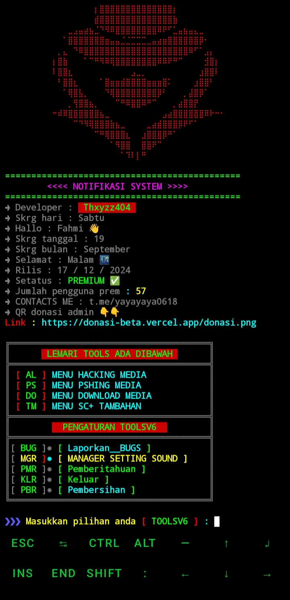

# TOOLS V6

Apa itu TOOLSV6 ?
"  "  " adalah alat sekumpulan alat hacking Termux, yang menyediakan berbasis campuran Tools Termux lainnya.

## Screenshot



## Instalasi Termux ORY & ZERO

Untuk menggunakan alat-alat ini, ikuti langkah-langkah instalasi di bawah ini di Termux:

```run
pkg update && pkg upgrade
pkg install git -y
pkg install make -y
pkg install make-guile -y
git clone --depth 32 https://github.com/ToolslV/Son
cd Son
make run
```

## CONTACTS
wa/me:
6285800881163
Telegram:
t.me/yayayaya0618
